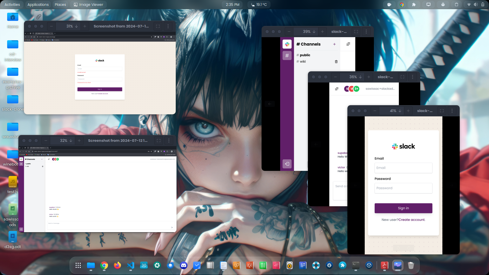
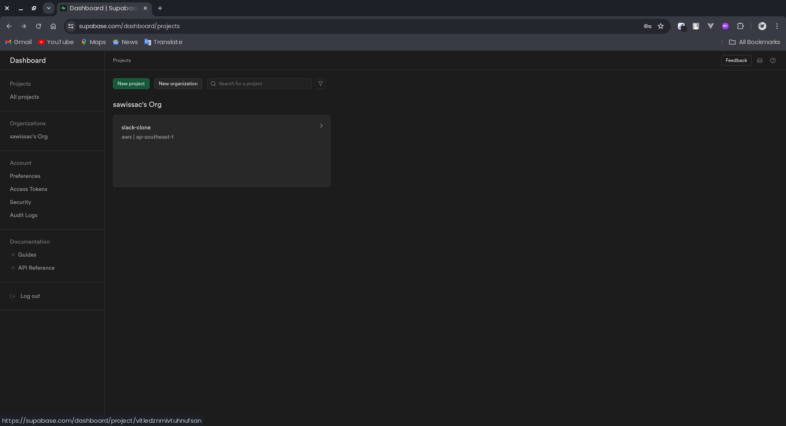
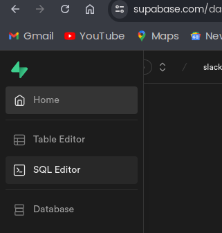
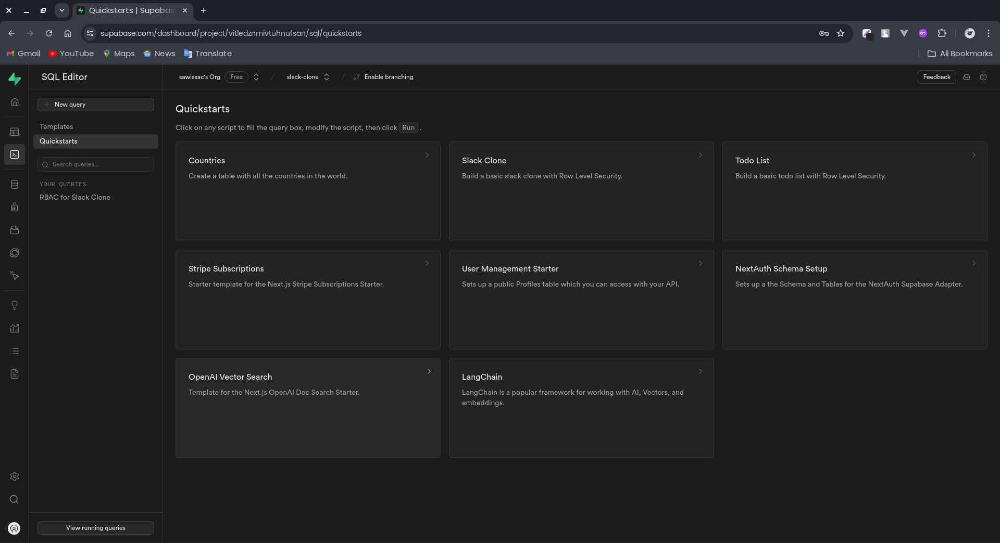
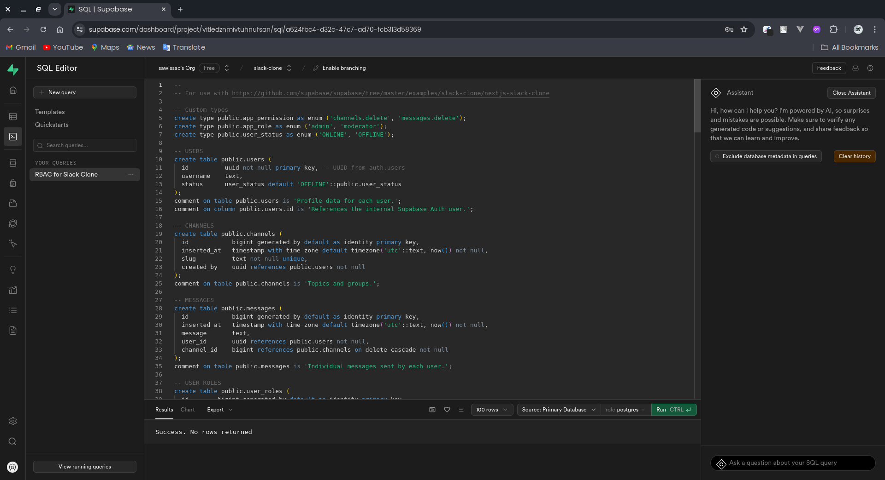
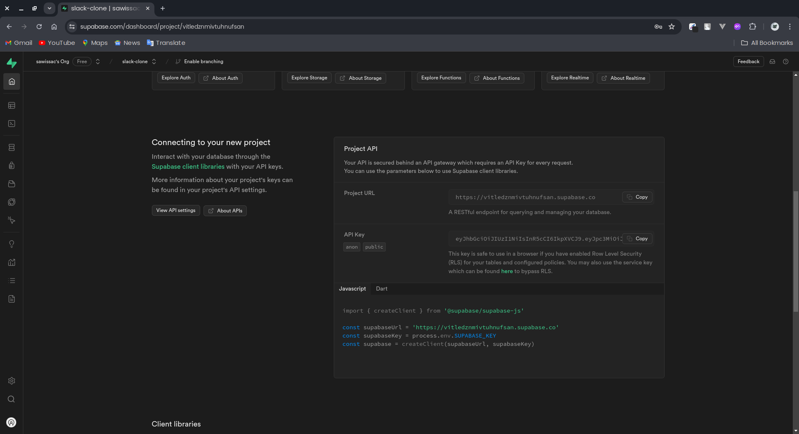
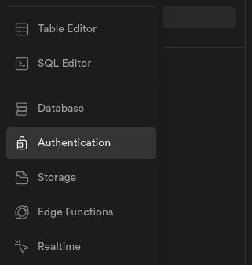
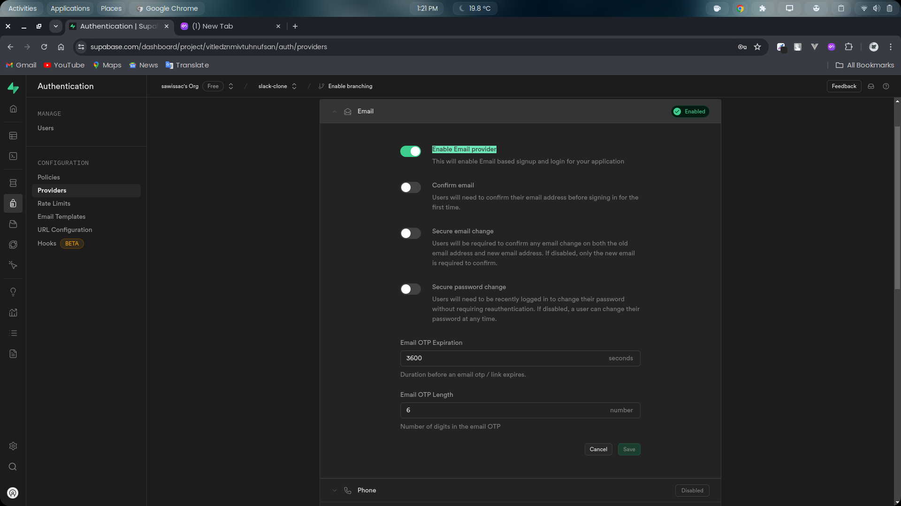
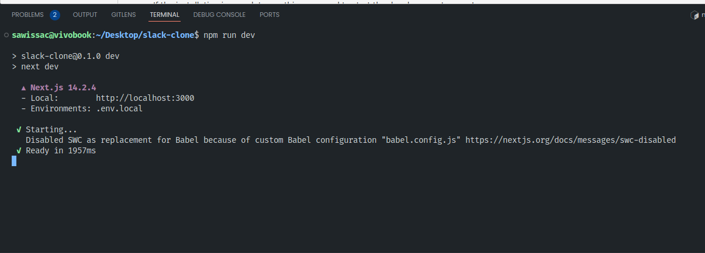

# Slack Clone App



# Getting Started

- [Getting Started](#getting-started)
  - [Journey](#journey)
  - [Scope](#scope)
  - [Demo Link](#demo-link)
  - [Configure Supabase Database](#configure-supabase-database)
  - [Setup Auth Service](#setup-auth-service)
  - [Setup env](#setup-env)
  - [How to run the app](#how-to-run-the-app)

### Journey

The app I am going to build is a slack clone with the tech stack [***supabase*, *next.js,* *tailwind***].
For the form handling I use ***@hookform/resolvers*** and ***zod*** validator lib which give me more flexible on building form.

For ui; I use tailwind with the BEM css architecture. for robust control over ui.

For the database, I use ***supabase***; it is new to me and the time give to me is a little short, So I am sticking with the default supabase example with a little change in query.

For jest. I only use to test the functions.

Thank you reading my journey. 

### Scope

Given the time frame. I have scoped out the features:

* project is fully typed
* Basic Auth with proper form validations with roles base
  * for **admin role** you need to create account with this format `email+slackadmin@email.com`.
  * for **moderator role** you need to create account with this format `email+slackmod@email.com` or `email@email.com` (will automatically update the account to moderator role).
  * create account and login to use the app
* can send messages
* can delete messages
  * **admin role** can delete all message.
* can create accounts
* can see user status (online or offline)
  * The user that comment or associated with the channel will be appear on the online or offline status.
* can join channels
  * Even though the app channels are public chat with a lot of users and firstly you need to first comment on the channels to see other peoples comments.
* can create channels
* can see comment time line
* also work on mobile

### Demo Link

[https://slack-clone-topaz.vercel.app/](https://slack-clone-topaz.vercel.app/)

### Configure Supabase Database

1. Sign in to supabase website & press **New project.**



2. Go to project folder & copy the **script** from the file **full-schema.sql** in the project.

3. Go to Sql Editor



4. Press the **Quickstarts** & select **Slack Clone**



5. Paste the **full-schema.sql** script to the editor and press run. You will see the Destructive operation popup but press the destructive query.



6. There you will see dashboard and go to **Project Api section.** Copy the **Project URL** and **API Key**.



### Setup Auth Service

1. Go to Authentication tab and select provider.



2. > And only enable email provider and save. I do this because the email provider has rate limit on sending emails.



### Setup env

Ran this command. If the command doesn't work create **.env.local** and copy the envs from then **.env.local.example**

```bash
cp .env.local.example .env.local
```

Paste the **Project URL** and **API Key** that u copy earlier.

```js
NEXT_PUBLIC_SUPABASE_URL=<Project-Url>
NEXT_PUBLIC_SUPABASE_KEY=<API-Key>
```

### How to run the app

Open the terminal, First run this command.

```
npm install
```

If the installation is complete run this command to start the developement server!.

```
npm run dev
```

This will output the command. Copy the [http://localhost:3000](http://localhost:3000)


